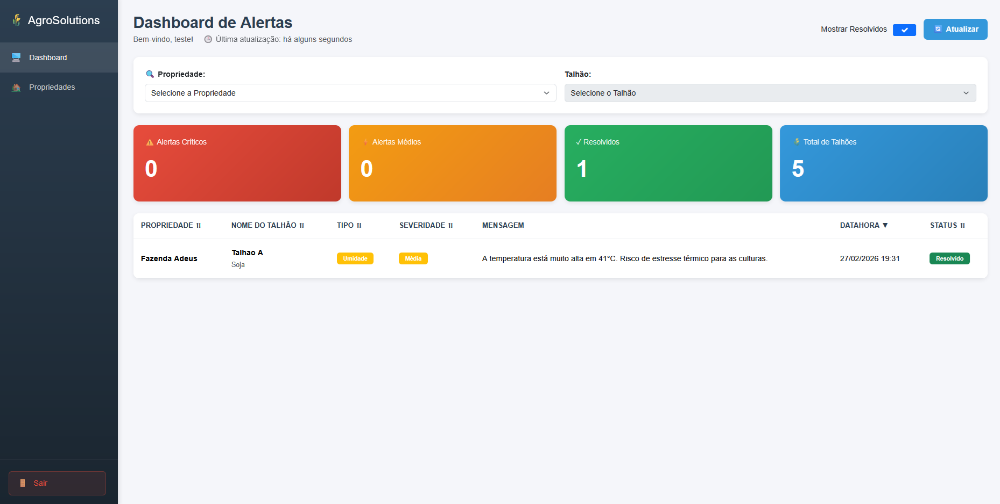

# AgroSolutions - Plataforma IoT para Agricultura de Precisão

[](https://github.com/devjoaomelo/fiap-AgroSolutions/actions)

Sistema completo de monitoramento agrícola baseado em IoT para otimização de recursos hídricos, aumento de produtividade e sustentabilidade no campo.

## Índice

- [Visão Geral](#visão-geral)
- [Arquitetura](#arquitetura)
- [Funcionalidades](#funcionalidades)
- [Tecnologias](#tecnologias)
- [Como Executar](#como-executar)
- [Testes](#testes)
- [CI/CD](#cicd)
- [Monitoramento](#monitoramento)
- [Frontend](#frontend)
- [API Documentation](#api-documentation)

## Visão Geral

A AgroSolutions é uma plataforma completa de agricultura 4.0 que coleta dados de sensores IoT no campo, processa alertas inteligentes e fornece um dashboard interativo para os produtores rurais tomarem decisões informadas sobre irrigação, controle de temperatura e gestão de precipitação.



### Problema Resolvido

- **Desperdício de recursos**: Irrigação sem dados em tempo real
- **Baixa produtividade**: Decisões baseadas apenas na experiência
- **Riscos climáticos**: Sem monitoramento contínuo das condições
- **Falta de visibilidade**: Sem dashboard centralizado para gestão

### Solução

Sistema distribuído end-to-end que oferece:
- **Backend**: 4 microserviços .NET 8 com arquitetura limpa
- **Frontend**: Dashboard Blazor WebAssembly moderno e responsivo
- **Mensageria**: RabbitMQ para comunicação assíncrona
- **Monitoramento**: Prometheus + Grafana em tempo real
- **CI/CD**: Pipeline automatizado com GitHub Actions
- **Containerização**: Docker Compose para deploy simplificado

## Arquitetura

### Diagrama de Microserviços
```
┌─────────────────────────────────────────────────────────────────┐
│                      Frontend (Blazor WASM)                     │
│  - Dashboard de Alertas    - Gestão de Propriedades            │
│  - Gestão de Talhões       - Simulador de Sensores             │
│  - Autenticação JWT        - Filtros e Ordenação               │
└────────────────────┬────────────────────────────────────────────┘
                     │ HTTP/REST
         ┌───────────┼───────────┬───────────┬───────────┐
         │           │           │           │           │
    ┌────▼────┐ ┌───▼────┐ ┌───▼─────┐ ┌───▼─────┐     │
    │Identity │ │Property│ │Ingestion│ │ Alerts  │     │
    │Service  │ │Service │ │Service  │ │ Service │     │
    │         │ │        │ │         │ │         │     │
    │- Auth   │ │- Props │ │- Sensors│ │- Rules  │     │
    │- Users  │ │- Fields│ │- Data   │ │- Notify │     │
    │- JWT    │ │- CRUD  │ │- Events │ │- CRUD   │     │
    └────┬────┘ └───┬────┘ └────┬────┘ └────┬────┘     │
         │          │           │           │           │
         │          │      ┌────▼──────┐    │           │
         │          │      │ RabbitMQ  │◄───┘           │
         │          │      │ (MassTransit)              │
         │          │      └───────────┘                │
         │          │                                   │
    ┌────▼──────────▼────────────────────────┐         │
    │     PostgreSQL (4 databases)           │         │
    │  - identity_db  - property_db          │         │
    │  - ingestion_db - alerts_db            │         │
    └────────────────────────────────────────┘         │
                                                        │
    ┌───────────────────────────────────────────────────┘
    │ Observability Stack
    ├─ Prometheus (métricas)
    ├─ Grafana (dashboards)
    └─ Seq (logs centralizados)
```


### Fluxo de Dados

1. **Autenticação**: Usuário faz login → Identity Service retorna JWT
2. **Cadastro**: Produtor cadastra propriedades e talhões via Frontend
3. **Simulação**: Frontend simula dados de sensor → Ingestion Service
4. **Publicação**: Ingestion publica evento `SensorDataReceived` no RabbitMQ
5. **Consumo**: Alerts Service consome evento automaticamente
6. **Processamento**: Motor de regras avalia condições e gera alertas
7. **Visualização**: Dashboard exibe alertas em tempo real com filtros

### Decisões Arquiteturais

#### Microserviços
**Decisão**: Separar sistema em 4 serviços independentes
**Justificativa**: 
- Escalabilidade individual (Ingestion pode escalar independente)
- Isolamento de falhas (problema no Identity não afeta Alerts)
- Tecnologias específicas por domínio
- Deploys independentes

#### Event-Driven com RabbitMQ
**Decisão**: Comunicação assíncrona via mensageria
**Justificativa**:
- Desacoplamento entre Ingestion e Alerts
- Resiliência (se Alerts cair, mensagens ficam na fila)
- Escalabilidade (múltiplos consumers)
- Auditoria (rastreamento de eventos)

#### Database per Service
**Decisão**: PostgreSQL separado para cada serviço
**Justificativa**:
- Isolamento de dados (segurança)
- Schemas independentes
- Backups e migrations isolados
- Sem dependências entre bases

#### Clean Architecture
**Decisão**: Camadas Domain → Application → Infrastructure → API
**Justificativa**:
- Testabilidade (domain isolado)
- Manutenibilidade
- Inversão de dependências
- Padrão da indústria

## Funcionalidades

### ✅ Backend Completo

#### Identity Service
- ✅ Registro de usuários com validações robustas
- ✅ Login com JWT (tokens persistentes)
- ✅ Hash de senhas com BCrypt
- ✅ Primeiro usuário vira Admin
- ✅ Event Store para auditoria
- ✅ CORS habilitado

#### Property Service
- ✅ CRUD completo de propriedades rurais
- ✅ CRUD completo de talhões
- ✅ Filtro multi-tenant (usuário vê apenas suas propriedades)
- ✅ Validação de área disponível
- ✅ Delete em cascata (propriedade → talhões)

#### Ingestion Service
- ✅ Recebimento de dados de sensores
- ✅ Validação de ranges (umidade, temperatura, precipitação)
- ✅ Publicação de eventos no RabbitMQ
- ✅ Persistência em banco
- ✅ CORS habilitado

#### Alerts Service
- ✅ Consumer automático de eventos
- ✅ Motor de regras de negócio configurável
- ✅ 3 tipos de alertas (Seca, Alta Temperatura, Chuva Forte)
- ✅ Prevenção de alertas duplicados (24h de cooldown)
- ✅ Consulta com filtros
- ✅ Marcar alertas como resolvidos

### ✅ Frontend Moderno (Blazor WASM)

#### Dashboard de Alertas
- ✅ Cards de estatísticas (Críticos, Médios, Resolvidos, Total)
- ✅ Tabela com ordenação clicável (6 colunas)
- ✅ Filtros por Propriedade e Talhão
- ✅ Toggle "Mostrar/Ocultar Resolvidos"
- ✅ Indicador "Última Atualização" com auto-refresh
- ✅ Confirmação antes de resolver alertas

#### Gestão de Propriedades
- ✅ Cards modernos com gradientes
- ✅ Visualização de área total e localização
- ✅ Modal de criação com validações
- ✅ Delete com confirmação
- ✅ Navegação para talhões

#### Gestão de Talhões
- ✅ Cards verdes por talhão
- ✅ Indicador de área disponível em tempo real
- ✅ Simulador de dados de sensor (botão por talhão)
- ✅ Validação de área (não pode exceder disponível)
- ✅ Delete individual
- ✅ Breadcrumb de navegação

#### UX/UI
- ✅ Autenticação persistente (localStorage)
- ✅ Logout funcional
- ✅ Toast notifications globais
- ✅ Validações em todos formulários
- ✅ Design responsivo
- ✅ Sidebar fixa com navegação
- ✅ Loading states

## Tecnologias

### Backend
- **.NET 8** - Framework principal
- **ASP.NET Core** - Web APIs RESTful
- **Entity Framework Core 8** - ORM
- **PostgreSQL 16** - Banco de dados
- **MassTransit 8** - Abstração para RabbitMQ
- **BCrypt.Net** - Hash de senhas
- **System.IdentityModel.Tokens.Jwt** - Geração de tokens

### Frontend
- **Blazor WebAssembly** - SPA Framework
- **Bootstrap 5** - CSS Framework
- **Custom CSS** - Design system próprio

### Mensageria
- **RabbitMQ 3** - Message broker
- **RabbitMQ Management** - Interface de administração

### Observabilidade
- **Seq** - Logs centralizados estruturados
- **Prometheus** - Coleta de métricas
- **Grafana** - Dashboards interativos
- **prometheus-net.AspNetCore** - Exporter .NET

### DevOps
- **Docker 24** - Containerização
- **Docker Compose** - Orquestração local
- **GitHub Actions** - CI/CD automatizado
- **Kubernetes** - Manifestos prontos para produção

### Testes
- **xUnit** - Framework de testes
- **Moq** - Mocking de dependências
- **FluentAssertions** - Assertions fluentes
- **Testes unitários** - Cobertura de regras críticas

## Como Executar

### Pré-requisitos

- **Docker Desktop** (obrigatório)
- **.NET 8 SDK** (apenas para desenvolvimento local)
- **Git** (para clonar o repositório)

### Executar Projeto Completo
```bash
# 1. Clone o repositório
git clone https://github.com/devjoaomelo/fiap-AgroSolutions.git
cd AgroSolutions

# 2. Suba toda a infraestrutura (backend + observability)
docker compose up -d

# 3. Aguarde ~30-60 segundos para tudo inicializar
docker compose ps  # Verificar se tudo está "Up"

# 4. Execute o frontend
cd src/frontend/AgroSolutions.Dashboard
dotnet run

# 5. Acesse http://localhost:5000
```

### Serviços Disponíveis

| Serviço | URL | Credenciais |
|---------|-----|-------------|
| **Frontend Dashboard** | http://localhost:5000 | - |
| Identity API | http://localhost:5001/swagger | - |
| Property API | http://localhost:5002/swagger | - |
| Ingestion API | http://localhost:5003/swagger | - |
| Alerts API | http://localhost:5004/swagger | - |
| RabbitMQ Management | http://localhost:15672 | guest/guest |
| Seq Logs | http://localhost:5341 | - |
| Prometheus | http://localhost:9090 | - |
| Grafana | http://localhost:3000 | admin/admin |

### Primeiro Uso

1. Acesse o frontend: http://localhost:5000
2. Clique em "Registrar"
3. Crie sua conta (primeiro usuário será Admin)
4. Faça login
5. Cadastre uma propriedade
6. Cadastre talhões na propriedade
7. Simule dados de sensor
8. Veja os alertas gerados automaticamente!

## Testes

### Executar Todos os Testes
```bash
# Na raiz do projeto
dotnet test

# Com detalhes
dotnet test --logger "console;verbosity=detailed"
```

### Testes por Serviço
```bash
# Identity (6 testes)
dotnet test src/services/Identity/AgroSolutions.Identity.Tests/

# Ingestion (8 testes)
dotnet test src/services/Ingestion/AgroSolutions.Ingestion.Tests/

# Alerts (6 testes)
dotnet test src/services/Alerts/AgroSolutions.Alerts.Tests/
```

### Cobertura

- **Total**: 20 testes unitários
- **Identity**: Validações de email, senha, hash, registro
- **Ingestion**: Validações de sensor data, publicação de eventos
- **Alerts**: Regras de negócio, cooldown, processamento de eventos

## CI/CD

### Pipeline GitHub Actions

Arquivo: `.github/workflows/ci-cd.yml`

**Jobs:**

1. **test** - Executa todos os testes unitários
2. **build-identity** - Build e push da imagem Identity
3. **build-property** - Build e push da imagem Property
4. **build-ingestion** - Build e push da imagem Ingestion
5. **build-alerts** - Build e push da imagem Alerts

**Triggers:**
- Push em `main`, `master`, `develop`
- Pull Requests para `main`, `master`

**Artefatos:**
- Imagens Docker no Docker Hub
- Logs de testes
- Coverage reports (planejado)

**Visualizar**: https://github.com/devjoaomelo/fiap-AgroSolutions/actions

## Monitoramento

### Grafana - Dashboard AgroSolutions

Acesse: http://localhost:3000

**Dashboard "AgroSolutions - Microservices Monitoring":**

1. **HTTP Requests Rate** - Requisições por segundo de cada API
2. **Memory Usage** - Consumo de RAM por serviço (MB)
3. **CPU Usage** - Percentual de CPU utilizado
4. **Total Requests** - Contador acumulado
5. **Active Threads** - Thread pool do .NET
6. **GC Collections** - Coletas de lixo por geração

**Como usar:**
- Dashboard atualiza automaticamente a cada 5 segundos
- Use o frontend enquanto observa os gráficos em tempo real
- Ideal para demonstrações ao vivo

### Prometheus

Acesse: http://localhost:9090

**Queries úteis:**
```promql
# Requests por segundo
rate(http_requests_received_total[5m])

# Memória em MB
process_working_set_bytes / 1024 / 1024

# CPU em %
rate(process_cpu_seconds_total[5m]) * 100
```

### Seq - Logs Estruturados

Acesse: http://localhost:5341

**Filtros úteis:**
```
@Level = 'Error'
@Level = 'Information'
ServiceName = 'agrosolutions-alerts-api'
@Message like '%SensorDataReceived%'
```

### RabbitMQ Management

Acesse: http://localhost:15672 (guest/guest)

Monitore:
- Filas ativas
- Mensagens publicadas/consumidas
- Throughput
- Consumers conectados

## Frontend

### Páginas

- **/login** - Autenticação
- **/register** - Cadastro de usuário
- **/dashboard** - Dashboard de alertas (página inicial)
- **/properties** - Gestão de propriedades
- **/fields/{propertyId}** - Gestão de talhões

### Recursos

- **Autenticação JWT** - Token armazenado no localStorage
- **Multi-tenant** - Cada usuário vê apenas seus dados
- **Responsivo** - Mobile-first design
- **Toast Notifications** - Feedback visual em todas operações
- **Validações** - Data Annotations + lógica de negócio
- **Loading States** - Spinners durante requisições
- **Confirmações** - Modais antes de ações destrutivas

## API Documentation

### Fluxo Completo (Frontend)

O frontend automatiza todo esse fluxo, mas as APIs podem ser chamadas diretamente:

#### 1. Registrar Usuário
```http
POST http://localhost:5001/api/auth/register
Content-Type: application/json

{
  "name": "Exemplo da Silva",
  "email": "exemplo@exemplo.com",
  "password": "Senha@123"
}
```

**Response:** 201 Created

#### 2. Login
```http
POST http://localhost:5001/api/auth/login
Content-Type: application/json

{
  "email": "exemplo@exemplo.com",
  "password": "Senha@123"
}
```

**Response:**
```json
{
  "accessToken": "eyJhbGc...",
  "expiresAtUtc": "2024-10-10T12:00:00Z"
}
```

#### 3. Cadastrar Propriedade
```http
POST http://localhost:5002/api/Properties
Authorization: Bearer {token}
Content-Type: application/json

{
  "userId": "user-guid",
  "name": "Fazenda São José",
  "location": "Campinas, SP",
  "totalArea": 500.0
}
```

#### 4. Cadastrar Talhão
```http
POST http://localhost:5002/api/Fields
Authorization: Bearer {token}
Content-Type: application/json

{
  "ruralPropertyId": "property-guid",
  "name": "Talhão Norte",
  "culture": "Soja",
  "area": 50.0
}
```

#### 5. Simular Sensor
```http
POST http://localhost:5003/api/SensorData
Content-Type: application/json

{
  "fieldId": "field-guid",
  "soilMoisture": 20.0,
  "temperature": 38.0,
  "precipitation": 60.0
}
```

**Resultado Automático:**
- Evento publicado no RabbitMQ
- Alerts Service processa
- 3 alertas gerados (Seca, Temperatura, Chuva)

#### 6. Consultar Alertas
```http
GET http://localhost:5004/api/Alerts?fieldId=field-guid
Authorization: Bearer {token}
```

**Response:**
```json
[
  {
    "id": "alert-guid",
    "fieldId": "field-guid",
    "type": "Seca",
    "severity": "Alta",
    "message": "Umidade do solo abaixo de 30%",
    "isResolved": false,
    "createdAt": "2024-10-10T10:30:00Z"
  }
]
```

## Kubernetes

Manifestos prontos em `/k8s`:
```
k8s/
├── deployments/
│   ├── identity-deployment.yaml
│   ├── property-deployment.yaml
│   ├── ingestion-deployment.yaml
│   └── alerts-deployment.yaml
├── services/
│   ├── identity-service.yaml
│   ├── property-service.yaml
│   ├── ingestion-service.yaml
│   └── alerts-service.yaml
└── configmaps/
    └── app-config.yaml
```

**Deploy:**
```bash
kubectl apply -f k8s/
```

## Regras de Negócio (Motor de Alertas)

| Condição | Tipo de Alerta | Severidade | Mensagem |
|----------|----------------|------------|----------|
| Umidade do solo < 30% | Seca | Alta | Umidade do solo abaixo de 30% |
| Temperatura > 35°C | AltaTemperatura | Média | Temperatura acima de 35°C |
| Precipitação > 50mm | ChuvaForte | Alta | Precipitação acima de 50mm |

**Cooldown:** 24 horas (evita alertas duplicados)

## Próximos Passos

- [ ] Integração com API de previsão do tempo
- [ ] Notificações push em tempo real (SignalR)
- [ ] Exportação de relatórios CSV/PDF
- [ ] Machine Learning para previsões
- [ ] App mobile (React Native)
- [ ] Integração com drones agrícolas

## Autor

**João Melo**
- GitHub: [@devjoaomelo](https://github.com/devjoaomelo)
- Projeto: Hackathon 8NETT - Pós-Graduação em Arquitetura de Software .NET

## Licença

Este projeto é parte de um trabalho acadêmico desenvolvido para o curso de pós-graduação em Arquitetura de Software .NET da FIAP.